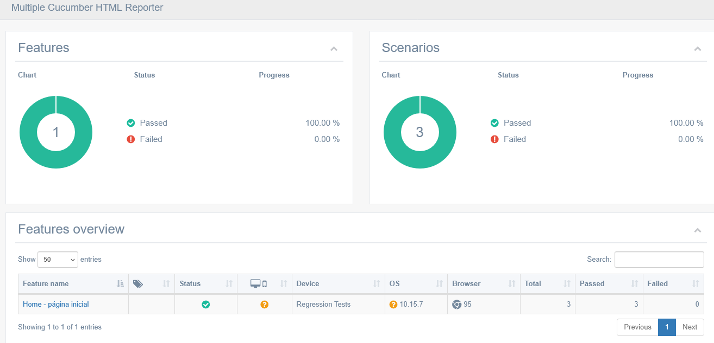
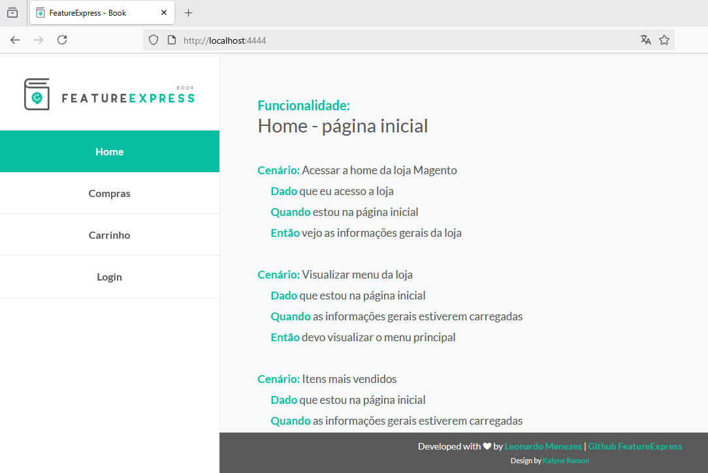

# Bem vindos ao Automação Loja Magneto Mais - área não logada

# Por que decidimos automatizar usando o Cypress ?
É uma ferramenta de teste de frontend desenvolvida para a web.

O Cypress pode testar qualquer coisa que seja executada em um navegador, e como o projeto da loja usa  Magneto nesse momento faz sentido usarmos o Cypress. Além dele permitir a escrita desses tipos de testes:

* Testes ponta a ponta
* Testes de integração
* Testes de unidade

# Pré requisitos

* [Node JS](https://nodejs.org/en/download/)
* [Visual Studio Code](https://code.visualstudio.com/download)
* [Cypress](https://www.cypress.io/)

> Alguns plugins do VSCode que facilitaram seu dia a dia :
- cucumber (Gherkin)
- cuke step definition generator
- vscode-icons

> Correção de acentuação gráfica no VSCOde :
- https://www.youtube.com/watch?v=pZVo4O4bNCU

# Clonando o projeto da aérea não logada
```
git clone https://github.com/C9999/cypress-magento.git
```

# Instalando as dependências do projeto
```
npm install
```

# Visualizar o modo interativo do Cypress
```
npm run open
```
Ao abrir o modo interativo do Cypress é recomendável usar a execução interna através do Electron 93. Pois a execução com navegadores externos leva mais tempo para abri-los completamente.

# Executar os testes no chrome via linha de comando
```
npm run test
```

# Gerar o Relatório de testes
```
npm run report
```


# Visualizar as features de forma elegante
```
npm install -g feature-express 
```
Depois vá até a pasta cypress/integration pois é nela que os arquivos .features estão

```
feature-express ./ pt 4444
```

